# 🕺 InfiniteDance 论文解读

## 可扩展的3D舞蹈生成：迈向真实场景的泛化能力

> **论文标题**: InfiniteDance: Scalable 3D Dance Generation Towards in-the-wild Generalization
>
> **arXiv编号**: 2603.13375v1 (2026年3月)
>
> **作者团队**: 清华大学 × 鹏城实验室 × 南洋理工大学 S-Lab
>
> **项目主页**: https://infinitedance.github.io/

---

## 📌 一句话概括

> 这篇论文做了一件事：**用AI自动从海量网络视频中提取高质量3D舞蹈数据，然后训练一个大模型，让它能根据任意音乐自动生成专业级的3D舞蹈动作**。

---

## 🎯 核心问题：现有方法的局限

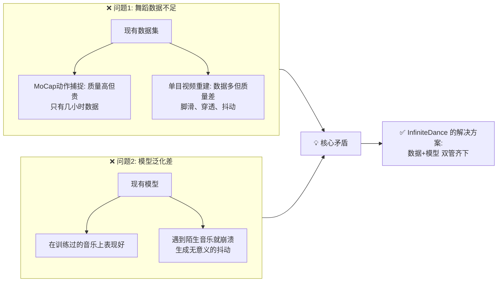

### 通俗理解

想象你要训练一个AI舞者：
- **数据问题**：用专业动捕设备录舞蹈，质量好但一天只能录几分钟，太贵；从网上视频提取，数据多但动作各种瑕疵（脚在地上滑、身体穿模、抖个不停）
- **模型问题**：现有AI在"听过"的音乐上跳得不错，但换一首风格不同的歌就乱跳了

---

## 🏗️ 论文方案总览

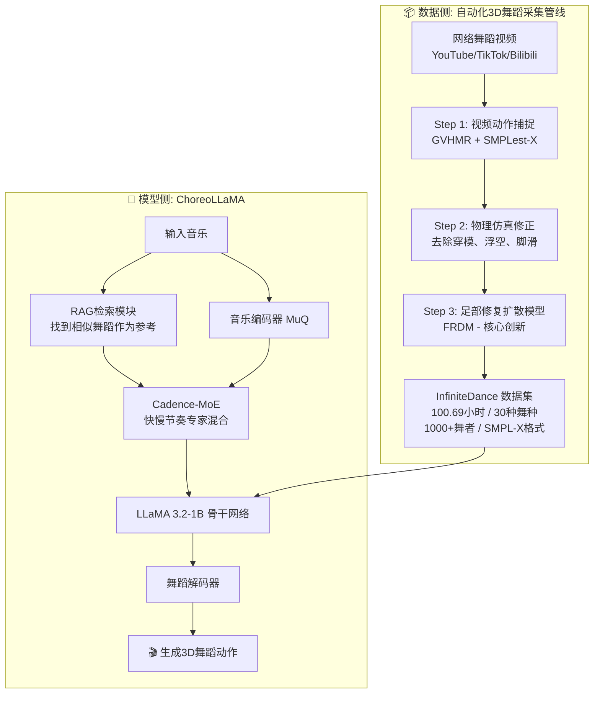

---

## 📦 第一部分：InfiniteDance 数据集

### 3.1 为什么现有数据集不够用？

| 数据集 | 采集方式 | 时长 | 关节 | 手部 | 面部 | 舞种 |
|--------|----------|------|------|------|------|------|
| AIST++ | 多相机+SMPLify | 5.2h | 17/24 | ❌ | ❌ | 10 |
| FineDance | 光学动捕 | 14.6h | 52 | ✅ | ❌ | 22 |
| MotoricaDance | 专业动捕设备 | 6.2h | 52 | ❌ | ❌ | 8 |
| POPDG | 单目视频估计 | 3.56h | 24 | ❌ | ❌ | 19 |
| **InfiniteDance** | **自动化管线** | **100.69h** | **55** | **✅** | **✅** | **30** |

> 📊 **关键突破**：用自动化管线实现了接近动捕的质量（甚至脚滑率更低！），同时达到了空前的数据规模。

### 3.2 三步自动化采集管线

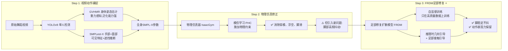

### 3.3 核心创新：足部修复扩散模型 (FRDM)

这是论文最精巧的设计。让我用一个类比来解释：

> **类比**：想象一个视频编辑任务——你有一段跳舞视频，只有脚部有问题（脚在地上滑、抖动），身体其他部分都很完美。FRDM就像一个"智能脚部修复滤镜"，它只修复脚部，不动上半身。

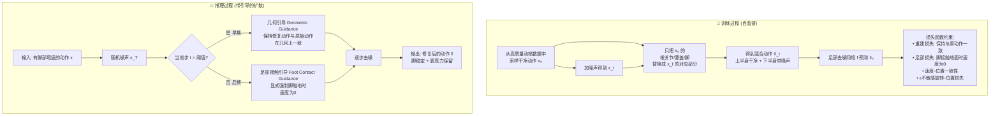

#### 为什么需要两种引导？

| | 几何引导 (早期) | 足部接触引导 (后期) |
|---|---|---|
| **目标** | 保持与原动作的一致性 | 强制脚部物理正确 |
| **做法** | 混合原动作和预测动作的旋转/位置 | 用原动作的速度替换预测速度 |
| **时机** | `t > t_th` (噪声大,需要结构约束) | `t < t_th` (噪声小,精修细节) |

> 💡 **设计巧思**：训练时只用损失函数隐式优化 → 推理时用显式引导强化效果。这样既避免了训练时损失权重过大导致动作"僵硬"，又能在推理时确保脚部稳定。

### 3.4 FRDM 效果验证

| 方法 | 脚滑率 FSR↓ | 抖动 Jitter↓ | 穿透率↓ |
|------|-------------|--------------|---------|
| GVHMR (原始估计) | 28.63% | 31.89 | 0.79% |
| GVHMR + 物理仿真 | 8.87% | 78.60 ⚠️ | 0.05% |
| GVHMR + 物理 + 平滑 | 14.29% | 15.39 | — |
| **GVHMR + 物理 + FRDM** | **5.09%** ✅ | **14.33** ✅ | **0.056%** |
| *FineDance (光学动捕)* | *6.22%* | *12.69* | *0.70%* |

> 🎉 **惊喜发现**：经过FRDM修复后，脚滑率(5.09%)竟然比专业光学动捕设备采集的FineDance(6.22%)还低！

### 3.5 数据集覆盖的舞蹈类型

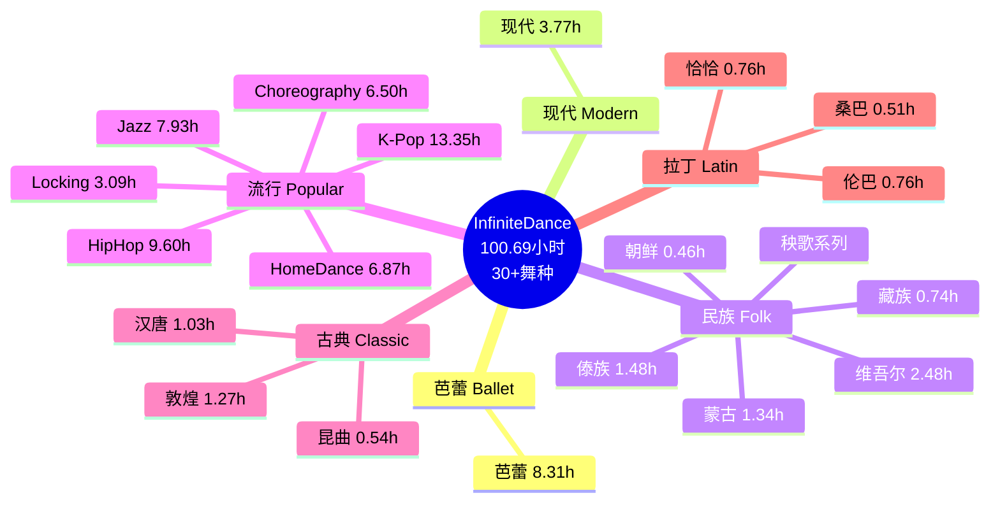

---

## 🧠 第二部分：ChoreoLLaMA 模型

### 4.1 整体架构

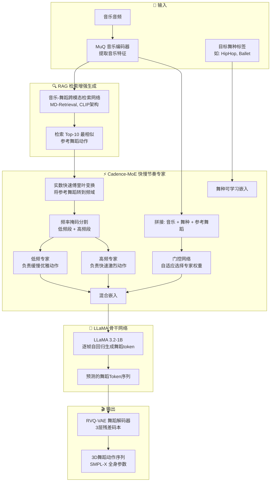

### 4.2 关键设计1：连续嵌入 vs 离散索引

这是一个看似微小但影响深远的设计选择：

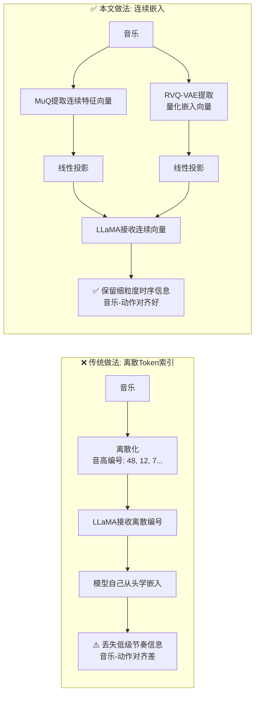

> 💡 **直观理解**：传统方法像把一首歌的旋律写成简谱数字"1-2-3-5-6"，然后让AI看数字学跳舞——丢失了大量细节。本文方法直接把音乐的"波形特征"喂给AI，信息量丰富得多。

### 4.3 关键设计2：RAG 检索增强生成

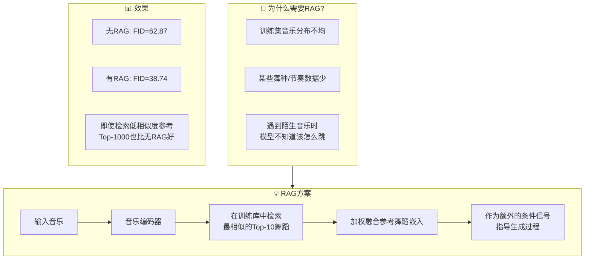

> 🎯 **核心思想**：就像人类舞者听到一首新歌，会先回忆"这首歌听起来像哪首我会跳的舞"，然后以那个为参考来编舞。RAG让AI也这样做。

### 4.4 关键设计3：Cadence-MoE 快慢节奏专家

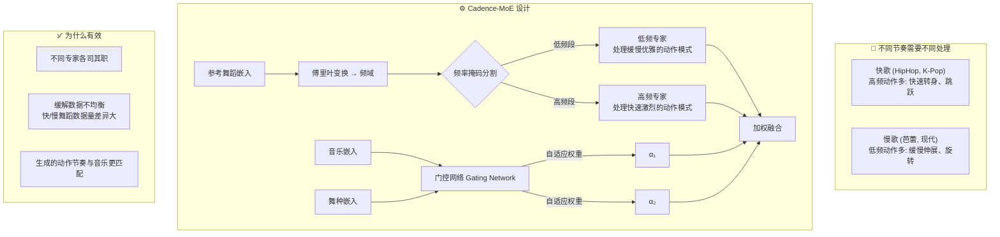

| 频段数量 | FID↓ | 分析 |
|----------|------|------|
| 2个频段 | 43.19 | ✅ 最佳：低频段已包含大部分有效信息 |
| 4个频段 | 118.49 | ❌ 过度切分导致信息分散 |

---

## 📊 第三部分：实验结果

### 5.1 在 InfiniteDance 测试集上的对比

| 方法 | FID_k↓ | FSR↓ | Div_k↑ | BAS↑ | 用户偏好 |
|------|--------|------|--------|------|----------|
| **真实动作 (GT)** | 2.55 | 5.09% | 9.37 | 0.2332 | 22.6% |
| Bailando | 117.38 | 15.56% | 5.46 | 0.2137 | 8.9% |
| EDGE | 82.37 | 14.15% | 5.28 | 0.2321 | 7.7% |
| Lodge | 89.52 | 6.72% | 5.00 | 0.2329 | 11.5% |
| **ChoreoLLaMA** | **30.54** | **5.33%** | **6.23** | **0.2342** | — |

> 🎉 ChoreoLLaMA 在所有指标上全面超越现有方法，FID提升2-4倍！

**指标解释**：
- **FID_k** ↓：生成动作与真实动作的"距离"，越低越像真的
- **FSR** ↓：脚滑率，越低越好
- **Div_k** ↑：动作多样性，越高说明跳法越多变
- **BAS** ↑：节拍对齐分数，越高越合拍

### 5.2 跨数据集泛化（关键实验！）

> 用 InfiniteDance 训练，在其他数据集上测试——**零样本迁移能力**

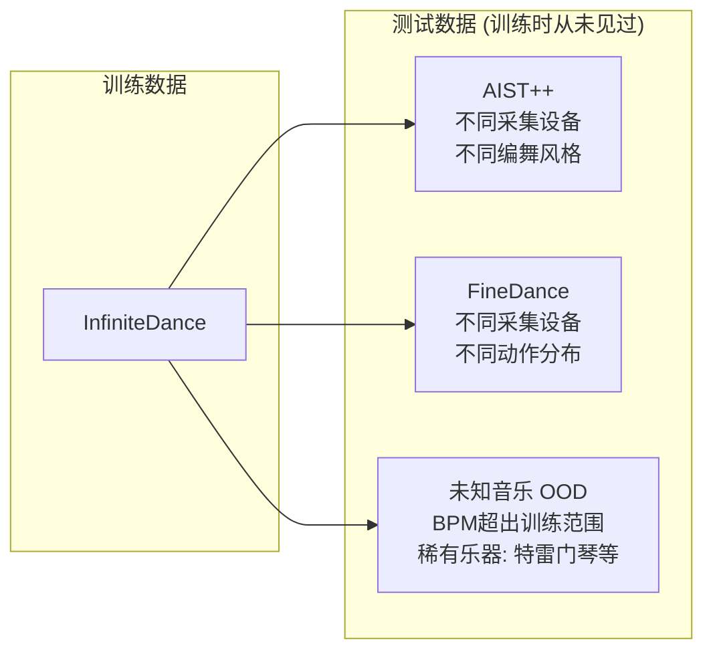

| 测试场景 | Lodge FID↓ | **ChoreoLLaMA FID↓** | 提升 |
|----------|-----------|----------------------|------|
| AIST++ (跨数据集) | 48.73 | **35.45** | ↓27% |
| FineDance (跨数据集) | 106.85 | **59.38** | ↓44% |
| 未知音乐 (OOD) | 119.66 | **56.22** | ↓53% |

> 🚀 **最大亮点**：在完全没见过的音乐上，ChoreoLLaMA的FID比Lodge降低了53%！

### 5.3 消融实验：每个模块的价值

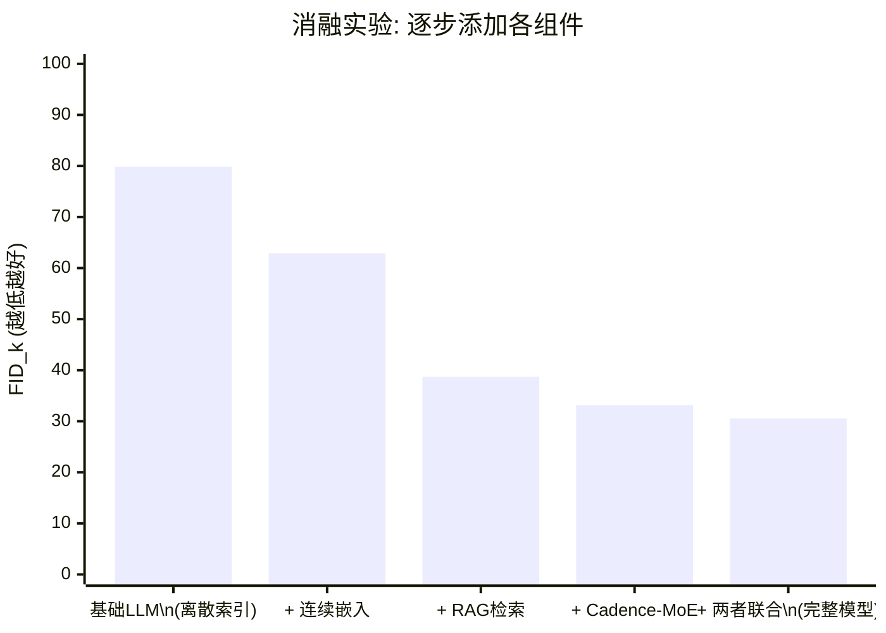

| 配置 | FID_k↓ | Div_k↑ | BAS↑ | 分析 |
|------|--------|--------|------|------|
| 离散Token索引 (基线) | 79.84 | 13.09 | 0.2073 | 多样性高但质量差 |
| + 连续嵌入 | 62.87 | 5.49 | 0.2269 | 质量大幅提升 |
| + RAG检索 | 38.74 | 6.16 | 0.2325 | **最大增益** ↓39% |
| + Cadence-MoE | 33.14 | 6.11 | 0.2348 | 进一步改善 |
| **完整模型** | **30.54** | **6.23** | **0.2342** | **最佳** |

> 💡 RAG贡献最大！说明"找参考舞蹈"这个策略非常有效。

### 5.4 长序列生成能力

| 方法 | FID_k↓ (长序列>30秒) | Div_k↑ | BAS↑ |
|------|---------------------|--------|------|
| Lodge | 106.85 | 4.14 | 0.2306 |
| **ChoreoLLaMA** | **39.72** | **6.01** | **0.2335** |

> ChoreoLLaMA生成超过30秒的长舞蹈仍保持高质量，不会崩溃。

### 5.5 推理速度

- **生成速度**: 42.8 FPS (单张A100)
- RAG开销: +34.2% (可离线预提取+并行检索优化)
- MoE开销: +12.0%

---

## 🎨 附加贡献：2D舞蹈视频生成

论文还展示了InfiniteDance数据集的下游应用——**姿态引导的2D舞蹈视频生成**：

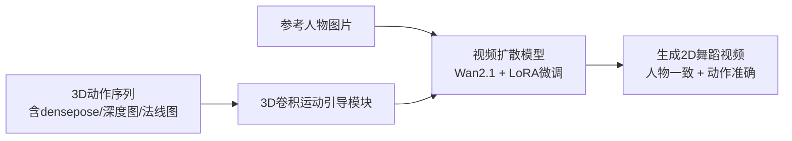

> 提供了丰富的中间表示（densepose、深度图、法线图），让2D视频生成更加可控。

---

## 📋 总结：贡献清单

| # | 贡献 | 一句话说明 |
|---|------|-----------|
| 1 | **FRDM 足部修复模型** | 用扩散模型+几何/接触双引导，把单目重建的脚部瑕疵修好 |
| 2 | **InfiniteDance 数据集** | 100.69小时/30舞种/全身+手+面部，规模和质量双领先 |
| 3 | **ChoreoLLaMA 模型** | LLaMA+RAG+MoE，音乐驱动舞蹈生成的全新架构 |

---

## ⚠️ 局限性（论文自述）

> 人类编舞是一个**迭代的、交互式的创作过程**——编舞师会不断尝试、获得反馈、修改动作。而 ChoreoLLaMA 目前只能做**一次性前向生成**：输入音乐和风格，直接输出舞蹈，无法在生成过程中根据反馈调整。

未来方向：支持**人机协作式的交互编舞**，让AI成为编舞师的"智能助手"而非"一键生成器"。

---

## 🔑 关键术语速查

| 术语 | 全称 | 含义 |
|------|------|------|
| **FRDM** | Foot Restoration Diffusion Model | 足部修复扩散模型 |
| **RAG** | Retrieval-Augmented Generation | 检索增强生成 |
| **MoE** | Mixture of Experts | 专家混合 |
| **SMPL-X** | — | 含手部和面部的3D人体参数模型 |
| **FSR** | Foot Skating Ratio | 脚滑率（脚该稳时却在地面滑动） |
| **FID** | Fréchet Inception Distance | 生成质量指标（越低越好） |
| **BAS** | Beat Alignment Score | 节拍对齐分数 |
| **RVQ-VAE** | Residual Vector Quantized VAE | 残差向量量化变分自编码器 |
| **MuQ** | — | 自监督音乐表征模型 |
| **PHC** | Perpetual Humanoid Control | 物理仿真器中的人形控制方法 |

---

## 📖 论文核心公式速览

### FRDM 的足部损失 L_Foot

```
L_Foot = Σ || (P̂_k^(i+1) - P̂_k^(i)) · b_k^(i) ||²
```

> 含义：当脚与地面接触时(b=1)，相邻两帧的脚位置变化应该为0（脚不能动）。这强制了"脚着地时不能滑动"的物理约束。

### ε-不敏感旋转-位置损失

```
L_εI-rp = Σ max(||FK(ĵ_k^r) - ĵ_k^p||² - ε, 0)²
```

> 含义：允许旋转推导的位置和实际位置之间有 ε 的容差——既能保持几何一致性，又给足部修复留出优化空间。

---

> 📝 **总结**：InfiniteDance 通过"数据+模型"双线并进的策略，把3D舞蹈生成推向了一个新的高度。数据侧用聪明的FRDM实现了"鱼与熊掌兼得"（规模大+质量高），模型侧用RAG+MoE大幅提升了泛化能力。论文最精彩的设计是FRDM中"训练时隐式+推理时显式引导"的策略，以及RAG带来的巨大性能提升——值得反复品味。
