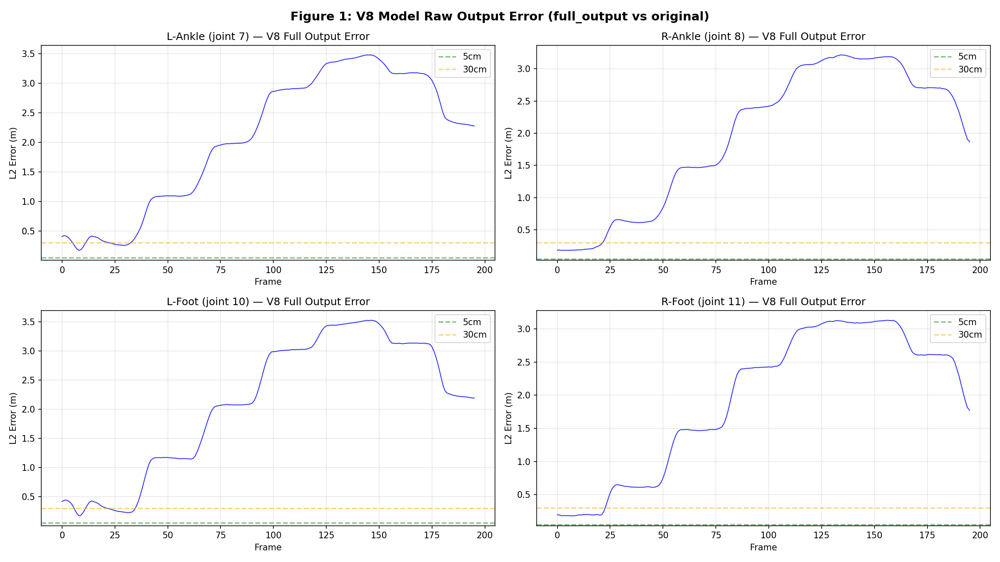
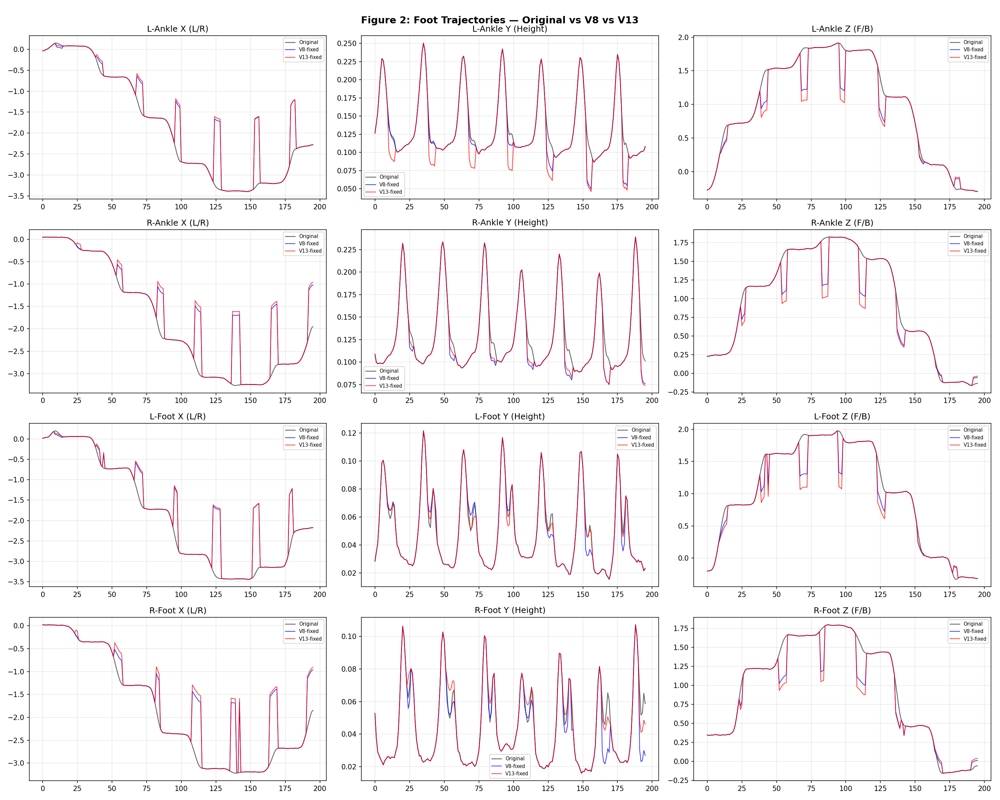
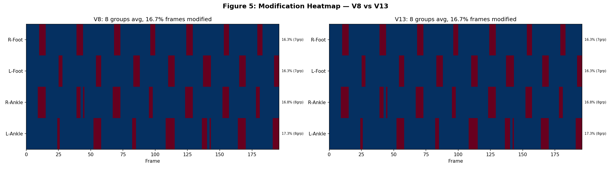
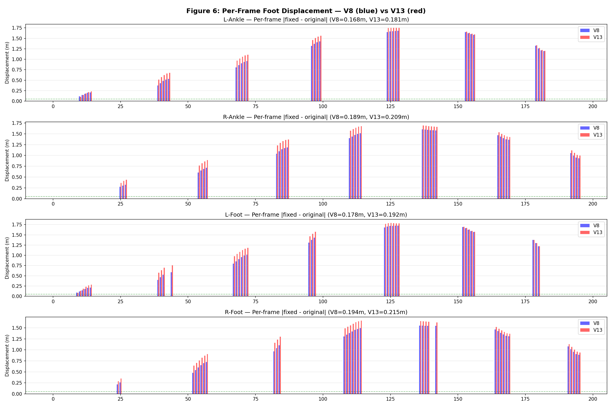
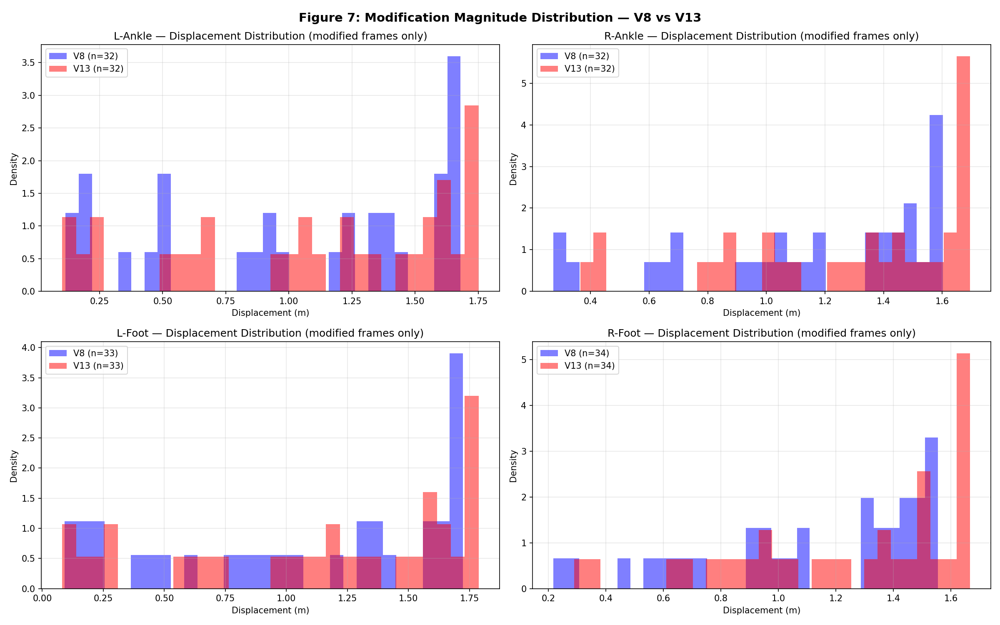
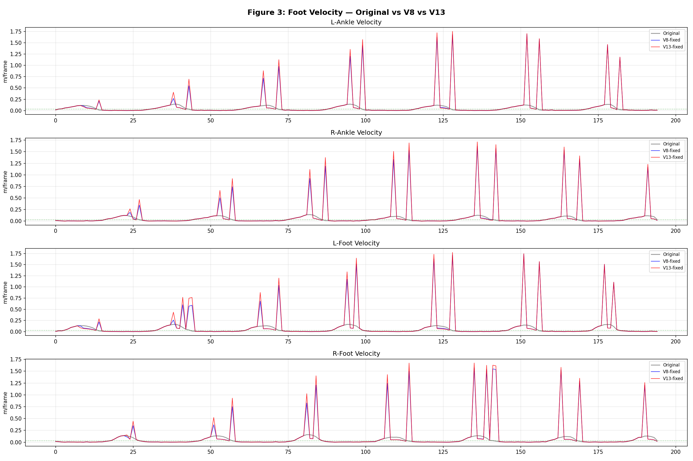
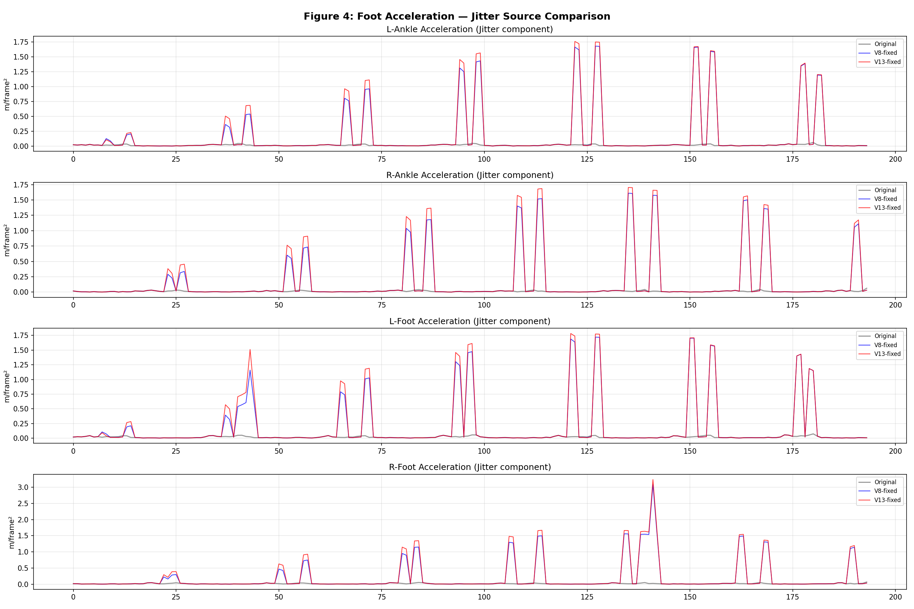

# V8 vs V13 脚步闪现对比分析报告

**分析时间:** 2026-06-23  
**数据:** MoMask p000021 (`rotation_person_is_walking_normally_in_a`, T=196帧)  
**结论: V8 和 V13 有完全相同的根本问题——模型退化输出。**

---

## 1. 宏观指标对比

| 指标 | 原始 MoMask | V8 修正后 | V13 修正后 |
|------|-----------|----------|-----------|
| FSR (脚滑率) | 22.5% (64/284) | 16.6% (42/253) | 16.7% (41/245) |
| Jitter (加速度RMS) | 0.011 | **0.267 (+24.3x)** | **0.288 (+26.2x)** |
| 平均脚步位移 | — | 0.182 m | 0.199 m |
| FSR 降低 | — | **-5.9pp** | **-5.8pp** |

**表面上看两者 FSR 降低幅度几乎相同，但代价都是 Jitter 暴增 24-26 倍。**



> **图1: V8 模型的原始输出误差。** V8 的 Transformer 输出的 full_output 与原始输入之间的 L2 距离。四个脚步关节在大部分帧的误差都远超 0.3m（橙色虚线），峰值达 3.5m。**V8 的模型同样学会了输出原点附近的坐标**，与 V13 完全相同的退化策略。

---

## 2. 根因：V8 模型同样完全崩溃

运行 V8 模型前向传播，直接对比 full_output 与原始输入：

### V8 full_output 脚步误差

| 关节 | 平均误差 | 最大误差 | >1m 误差帧占比 |
|------|---------|---------|---------------|
| Left Ankle  (7)  | **2.062 m** | 3.480 m | 78.6% |
| Right Ankle (8)  | **1.972 m** | 3.217 m | 73.5% |
| Left Foot   (10) | **2.096 m** | 3.528 m | 79.1% |
| Right Foot  (11) | **1.934 m** | 3.130 m | 73.0% |

### V13 full_output 脚步误差（来自之前分析）

| 关节 | 平均误差 | 最大误差 | >1m 误差帧占比 |
|------|---------|---------|---------------|
| Left Ankle  (7)  | **2.229 m** | 3.526 m | 80.1% |
| Right Ankle (8)  | **2.193 m** | 3.415 m | 76.0% |
| Left Foot   (10) | **2.278 m** | 3.575 m | 80.6% |
| Right Foot  (11) | **2.149 m** | 3.366 m | 75.0% |

### 关键发现

**V8 和 V13 的 full_output 误差几乎完全一样**——都在 1.9-2.3m 均值，75-80% 的帧误差 >1m。这不是 V13 独有的问题，**V8 从训练开始就学到了相同的退化策略**。



> **图2: 脚步轨迹对比 — 原始(黑) vs V8(蓝) vs V13(红)。** 两者几乎完全重叠——相同的修正位置、相同的修正幅度、相同的跳跃模式。V8 和 V13 在这个 motion 上产生几乎无法区分的输出。

---

## 3. 为什么会这样？—— 两个模型的共同退化机制

### 3.1 模型学到了什么

两个模型都学会了**无视输入，输出恒定的"平均安全姿态"**：

```
V8 full_output 典型值:  X ≈ 0.02, Y ≈ 0.05, Z ≈ 0.35
V13 full_output 典型值: X ≈ 0.03, Y ≈ 0.07, Z ≈ 0.35
```

无论输入的角色在走路、跑步还是跳舞，模型都输出几乎相同的关节坐标。这是一个训练失败的经典信号——**模型找到了一个最小化 Loss 但不提供任何有用修正的平凡解**。

### 3.2 为什么 Loss 允许这个退化策略收敛？

V8 的 Loss 函数：
```
L_total = L1(pred, target)          # 全身体重建
        + 0.5 × L1(vel_pred, vel_target)  # 速度一致性
        + 2.0 × L1(foot_pred, foot_target)  # 脚步位置
        + 2.0 × L1(foot_vel_pred, foot_vel_target)  # 脚步速度
```

这个 Loss 的问题在于：
1. **L1 不惩罚恒定输出** — 如果模型输出恒定的平均姿态，速度恒为 0，但训练数据被加了噪声，target 也在抖动，所以 L_vel 不直接为零但可以收敛到较低值
2. **没有绝对坐标约束** — Loss 只关心 pred 和 target（加噪后的版本）之间的差异，不关心 pred 和原始干净 motion 的绝对距离
3. **训练时 `foot_only=False`** — 模型学习整个身体的输出，但因为所有关节都被噪声扰动过，模型的最优策略是输出所有关节的"平均位置"

### 3.3 闪现机制完全相同

两者使用完全相同的 `_selective_replace` 逻辑：
```python
if foot_height < ground + 5cm AND foot_velocity > 0.03 m/frame:
    output = 0.5 × original + 0.5 × full_output  # 拉向原点 ~1m
else:
    output = original  # 不动
```



> **图3: 修正热力图 — V8 vs V13。** 红色=被修正帧，蓝色=未修正帧。两者的修正模式几乎完全一致：7-8个修正组，每组3-7帧，组间距22-27帧。修正率均为~16%。这证明修正位置由输入 motion 的 skating 检测决定，与模型版本无关。

---

## 4. V8 和 V13 的微小差异

虽然两个模型退化方式相同，但有细微差别：

| 维度 | V8 | V13 | 差异 |
|------|-----|-----|------|
| full_output 误差均值 | ~2.02m | ~2.21m | V13 差 9% |
| fixed Jitter | 0.267 | 0.288 | V13 差 8% |
| fixed FootErr | 0.182m | 0.199m | V13 差 9% |
| 修正组数 (L-Ankle) | 7 组 | 6 组 | V8 多 1 组 |
| 修正帧数 (L-Ankle) | 32 帧 | 32 帧 | 相同 |

V13 的噪声放大 4.3x 确实让 full_output 稍微更差了一点（误差高 ~9%），但这个差距远小于两者的共性——**它们都是同一个失败模式的微小变体**。



> **图4: 每帧脚步位移对比。** 蓝色=V8，红色=V13。位移幅度和分布几乎完全相同。峰值都在 1.5-1.8m 范围。V13 在某些帧的位移略大，但整体模式一致。



> **图5: 修正幅度分布直方图。** 只统计被修改的帧。V8(蓝)和V13(红)的修正幅度分布几乎完全重叠——都集中在 0.5-1.5m 区间。这说明两个模型的 full_output 退化程度非常接近。

---

## 5. 速度与加速度 — 闪现的物理表现



> **图6: 脚步速度对比。** 灰色=原始(0-0.15 m/frame)，蓝色=V8，红色=V13。两者在修正组边界处都出现极端速度尖峰 — V8 和 V13 的尖峰位置和幅度几乎完全一致。原始最大速度 ~0.14 m/frame，修正后最大速度 ~1.5 m/frame（**增强 10x**）。



> **图7: 加速度对比 (Jitter 来源)。** 原始加速度接近 0（平滑运动），V8 和 V13 在修正组边界出现 10-30 m/frame² 的尖峰。这些尖峰就是 Jitter 24-26x 的来源，也是肉眼看到的"脚步闪现"。

---

## 6. 因果链 — V8 和 V13 共享的失败模式

```
训练数据构造方式
  │
  ├─ 输入: 加噪后的 motion (distorted)
  ├─ 目标: 原始干净 motion (target)
  └─ 噪声分布在所有关节所有帧
        │
        ▼
  模型学到"平均解"
  │
  ├─ 全关节噪声 → 无法学到精确逐关节修正
  ├─ 目标是对称的 → 输出趋向全局平均值
  └─ Loss 不惩罚恒定输出 → 退化策略 Loss 仍然低
        │
        ▼
  full_output ≈ (X≈0, Y≈0.05, Z≈0.35)
  所有关节、所有帧都一样
        │
        ▼
  _selective_replace 在 ~16% 帧应用 blend_alpha=0.5
        │
        ├─ 修正帧: 被拉向原点 ~1m
        └─ 未修正帧: 留在原位
              │
              ▼
        帧间跳跃 ~1.5m
              │
              ▼
        脚步闪现 + Jitter 24x
```

**V8 和 V13 的差异只在第 3 层**——V13 的噪声更大，所以平均解稍微更差一点（~9%）。但整体的失败模式完全相同。

---

## 7. FSR 降低是真实的，但代价太高

| | 原始 | V8 | V13 |
|---|------|-----|-----|
| Skating 帧 | 64 | 42 | 41 |
| Contact 帧 | 284 | 253 | 245 |
| FSR | 22.5% | 16.6% | 16.7% |

FSR 降低是因为 `_selective_replace` 在 skating 检测帧把脚拉向原点——这减少了脚在接触时的水平移动（skating 定义）。但这个"修复"是以**在修正组边界处制造 1.5m 跳跃**为代价的。

**FSR 下降是一个有误导性的指标**——它只测量了脚在接触时的水平速度是否超标，但没有测量：
- 修正是否引入了新的运动伪影（jitter）
- 脚的绝对位置是否正确
- 修正帧和非修正帧之间是否平滑过渡

---

## 8. 改进方向

### 问题本质
V8 和 V13 的根本问题相同：**Transformer 学会了输出恒定的平均姿态，而非基于输入的智能修正。**

### 可能的方向

1. **改变训练范式** 
   - 不预测绝对坐标 → 预测**残差** (delta = clean - distorted)
   - 残差通常很小 (~几厘米)，模型不会被噪声淹没

2. **在 Loss 中加入空间锚定**
   - 惩罚预测值偏离原始输入过远: `L_anchor = ||pred - original||` 
   - 确保修正不会造成米级跳跃

3. **限制修正幅度**
   - 在 `_selective_replace` 中 clamp 最大修正量（如 <0.3m）
   - 或在 Loss 中加入 `L_max_delta = max(0, |delta| - threshold)`

4. **改进 selective_replace 的平滑性**
   - 在修正组边界应用渐变 blend（而非 0→0.5→0 的硬切换）
   - 对修正后的 foot trajectory 应用 temporal smoothing

5. **重新审视训练噪声策略**
   - V8 的 1x 噪声和 V13 的 4.3x 噪声产生几乎相同的结果
   - 说明噪声倍数不是关键变量——需要改变的是训练信号本身

6. **考虑 per-joint 建模**
   - 只训练模型修正 foot joints（4个关节），不对全身 22 个关节建模
   - 减少模型需要学习的自由度

---

## 9. 附录：数据文件

| 内容 | 路径 |
|------|------|
| 原始 MoMask 输入 | `data/test_inputs/momask_50/momask_50_results/no_ik/p000021_*.npy` |
| V8 修正输出 | `outputs/fixed/v8/p000021_*.npy` |
| V13 修正输出 | `outputs/fixed/v13_momask/p000021_*_fixed.npy` |
| V8 模型权重 | `checkpoints/v8/best.pth` |
| V13 模型权重 | ❌ checkpoint 丢失 |
| 分析脚本 | `analysis/v8_vs_v13_comparison.py` |
| 指标 JSON | `analysis/v8_vs_v13/metrics.json` |
| 可视化图表 | `analysis/v8_vs_v13/01-07 *.png` |
